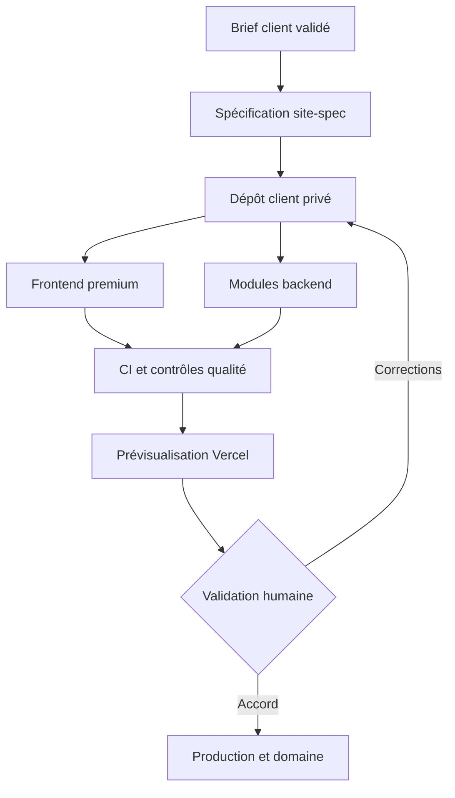

# OptimalLogic — Architecture de l’atelier de création de sites premium

**Date : 24 août 2026**  
**Statut : recommandation d’architecture, avant implémentation**

## 1. Décision recommandée

OptimalLogic ne doit pas commencer par construire une plateforme entièrement autonome pilotée par plusieurs agents. La bonne première version est un **atelier semi-automatisé, contrôlable et documenté** :

1. un brief client est transformé en spécification structurée ;
2. un dépôt privé est créé depuis un modèle versionné ;
3. le frontend est composé avec des blocs premium et une direction artistique propre au client ;
4. les fonctions backend nécessaires sont installées sous forme de modules ;
5. les tests automatiques bloquent les versions insuffisantes ;
6. Vercel crée une prévisualisation ;
7. une validation humaine est obligatoire avant la production.

L’IA intervient pour analyser, proposer, rédiger et coder. Les opérations déterministes — création du dépôt, validation du brief, installation des modules, tests et déploiement — doivent être réalisées par des scripts et par la CI.

Cette architecture donne de la vitesse sans transformer le système en boîte noire.

## 2. Ce que montre le dépôt actuel

L’inspection en lecture seule de `esigelecParfait/OptimalLogic` montre une base technique déjà sérieuse :

- Next.js `16.2.6`, React `19.2.4`, TypeScript et Tailwind CSS 4 ;
- App Router avec pages publiques, administration, espace client et routes API ;
- Supabase pour les données et l’authentification ;
- intégrations Cal.com, Brevo et Apps Script ;
- fonctions de limitation de débit et plusieurs contrôles de sécurité ;
- deux branches liées à la refonte : `refonte-premium-v2` et `refonte-template-premium` ;
- des modèles de prévisualisation sous `app/preview/` ;
- un premier client et ses réglages directement intégrés au dépôt sous `components/clients/` et `lib/clients/`.

Les principaux écarts d’industrialisation sont les suivants :

- le site d’OptimalLogic, les prototypes et le code client sont mélangés ;
- `package.json` ne contient actuellement que `dev`, `build`, `start` et `lint` : il n’y a pas de tests unitaires ou end-to-end déclarés ;
- le `README.md` est encore celui de `create-next-app` ;
- `AGENTS.md` ne contient qu’une mise en garde concernant Next.js, sans règles d’architecture, de sécurité, de validation ou de livraison ;
- la documentation de base de données est dispersée et les scripts SQL ne suivent pas encore le flux standard `supabase/migrations/` ;
- `.env.example` ne décrit pas toutes les variables réellement utilisées par l’application.

Conclusion : **nous devons conserver la stack, mais séparer l’usine de production du site institutionnel**.

## 3. Architecture cible



### Dépôts à utiliser

| Dépôt | Rôle | Contenu |
|---|---|---|
| `OptimalLogic` | Site de l’entreprise | Site public, administration et espace client d’OptimalLogic uniquement |
| `optimallogic-site-template` | Base versionnée | Squelette Next.js, bibliothèque de blocs, tests, recettes backend et règles de qualité |
| `optimallogic-studio` | Outil interne | CLI, schémas de brief, skills, scripts de génération, documentation et suivi des versions |
| `client-{slug}` | Un dépôt privé par client | Code final du site, contenu, migrations, tests et historique propre au client |

GitHub permet de créer un nouveau dépôt à partir d’un dépôt modèle, manuellement ou par API. Le nouveau dépôt reçoit sa propre histoire et devient indépendant du modèle. [Documentation GitHub sur les dépôts modèles](https://docs.github.com/en/repositories/creating-and-managing-repositories/creating-a-template-repository)

### Pourquoi un dépôt par client

- isolation du code et des secrets ;
- historique et rollback propres au client ;
- déploiement, domaine et base de données indépendants ;
- transfert de propriété possible ;
- un incident sur un site ne bloque pas les autres ;
- aucune dépendance d’exécution au site d’OptimalLogic.

Le modèle sert au démarrage. Les sites produits ne doivent pas dépendre à chaque exécution d’un package central qui pourrait tous les casser simultanément.

## 4. L’élément central : `site-spec`

Le système ne doit jamais recevoir seulement une consigne vague telle que « crée un site premium ». Il doit travailler à partir d’un fichier validé, par exemple `site-spec.yaml`, contenant au minimum :

- identité, secteur et localisation de l’entreprise ;
- cible principale et problèmes clients ;
- proposition de valeur et preuves disponibles ;
- objectifs de conversion et appels à l’action ;
- pages et parcours attendus ;
- contenus fournis, contenus à rédiger et informations interdites à inventer ;
- logo, palette, typographies et références visuelles ;
- direction artistique choisie ;
- modules backend requis ;
- intégrations externes ;
- contraintes légales, domaine et propriétaire des comptes ;
- critères d’acceptation.

Le fichier est validé par un schéma. Une donnée obligatoire manquante doit arrêter la génération et produire une question précise. Cela évite que l’agent compense par des inventions.

## 5. Frontend : une bibliothèque de blocs, pas des copies de modèles

La base frontend conserve Next.js 16, TypeScript et Tailwind 4. Il n’est pas nécessaire de changer de framework.

Le modèle contiendra :

- des **tokens de design** : couleurs, typographie, espaces, rayons, ombres, grille et mouvements ;
- des **primitives accessibles** : boutons, champs, modales, menus et accordéons ;
- des **blocs de page avec plusieurs variantes** : hero, preuve, services, processus, galerie, FAQ, équipe, tarifs et CTA ;
- des **directions artistiques** plutôt que des modèles sectoriels rigides : éditoriale, chaleureuse, institutionnelle, technique ou minimaliste ;
- un contenu séparé de la structure dans `content/` et `config/` ;
- des images optimisées avec dimensions explicites et formats modernes ;
- une politique de mouvement respectant `prefers-reduced-motion`.

Le générateur choisit une composition initiale. L’agent frontend l’adapte ensuite au brief. Le système doit produire du code lisible et directement modifiable, pas une page enfermée dans un constructeur propriétaire.

### Structure proposée d’un site généré

```text
src/
  app/                  pages, layouts et route handlers
  components/
    ui/                 primitives
    blocks/             sections réutilisables
  features/             fonctionnalités métier isolées
  content/              textes et données éditoriales
  config/               marque, navigation, SEO et modules
  lib/                  services techniques partagés
supabase/
  migrations/           schéma, politiques RLS et fonctions SQL
  seed.sql               données de démonstration non sensibles
tests/
  e2e/                  parcours utilisateur
  api/                  comportements backend
docs/                    architecture et exploitation
AGENTS.md                règles permanentes du dépôt
```

Next.js permet cette organisation avec l’App Router, la colocation des fichiers et les Route Handlers pour les endpoints HTTP. [Structure de projet Next.js](https://nextjs.org/docs/app/getting-started/project-structure), [Route Handlers](https://nextjs.org/docs/app/getting-started/route-handlers)

## 6. Backend : modules installables et vérifiables

Nous ne devons pas créer un backend identique et surdimensionné pour tous les clients. Chaque site reçoit seulement les modules dont il a besoin.

### Catalogue initial

| Module | Contenu |
|---|---|
| `lead-capture` | formulaire, validation serveur, consentement, anti-spam, rate limit, stockage du prospect, notification et tracking UTM |
| `booking-cal` | récupération des créneaux, réservation et gestion des erreurs Cal.com |
| `client-auth` | Supabase Auth, profils, organisations ou membres, réinitialisation du mot de passe et protections de routes |
| `client-portal` | commandes ou services, étapes d’avancement, documents et support |
| `media-storage` | buckets Supabase, limites de taille, types de fichiers et droits d’accès |
| `email-brevo` | modèles transactionnels, envoi, reprise sur erreur et journalisation minimale |
| `assistant-ai` | configuration par client, limites, refus, journalisation et protection des secrets |
| `analytics-consent` | consentement, événements métier et paramètres UTM |

Chaque module doit fournir ensemble :

1. son code serveur ;
2. ses composants frontend éventuels ;
3. ses migrations SQL ;
4. ses politiques RLS ;
5. la liste de ses variables d’environnement ;
6. ses tests ;
7. une courte documentation expliquant son fonctionnement.

Pour les sites standards, Next.js Route Handlers et Supabase suffisent. Un serveur séparé ne sera créé que pour un besoin démontré : traitements longs, files de tâches, fortes contraintes d’intégration ou charge particulière.

### Règles de données

- développement local avec Supabase CLI ;
- modifications de schéma exclusivement versionnées dans `supabase/migrations/` ;
- test de reconstruction complète de la base avant livraison ;
- RLS et privilèges déclarés dans les mêmes migrations ;
- clé `service_role` uniquement côté serveur ;
- base de production séparée par client ;
- environnement de prévisualisation sans données réelles de production.

Supabase recommande de conserver les migrations en contrôle de version et de tester localement leur réapplication. Sa documentation demande également d’activer RLS et de limiter les privilèges sur chaque table exposée. [Migrations Supabase](https://supabase.com/docs/guides/local-development/database-migrations), [sécurité RLS](https://supabase.com/docs/guides/database/postgres/row-level-security)

## 7. Rôle des agents, skills et automatisations

### `AGENTS.md` : les règles permanentes

Chaque dépôt généré doit contenir des règles compréhensibles :

- architecture autorisée ;
- commandes obligatoires avant livraison ;
- exigences responsive, accessibilité, SEO et sécurité ;
- interdiction d’inventer avis, résultats, partenaires ou certifications ;
- règles de gestion des secrets ;
- critères pour créer une nouvelle dépendance ;
- critères de validation d’une PR.

Codex lit `AGENTS.md` avant de travailler et permet des règles plus spécifiques dans les sous-dossiers. [Documentation officielle `AGENTS.md`](https://learn.chatgpt.com/docs/agent-configuration/agents-md)

### Skills à construire après validation de l’architecture

| Skill | Responsabilité | Sortie contrôlable |
|---|---|---|
| `optimallogic-site-intake` | transformer les informations client en brief complet | `site-spec.yaml` + questions manquantes |
| `optimallogic-art-direction` | définir tokens, composition et règles visuelles | `brand-tokens.json` + plan des pages |
| `optimallogic-backend-recipes` | sélectionner et installer les modules backend | migrations, code, variables et tests |
| `optimallogic-qa-release` | auditer et préparer la livraison | rapport PASS/FAIL avec preuves |

Une skill est appropriée ici parce qu’elle réunit des instructions, références, modèles et scripts pour un workflow répété. [Documentation officielle sur les skills](https://learn.chatgpt.com/docs/build-skills)

### Sous-agents

Ils seront utilisés pour les travaux réellement indépendants :

- audit visuel de plusieurs pages ;
- revue séparée sécurité, accessibilité et tests ;
- recherche de contenu et analyse concurrentielle ;
- exploration de différentes parties d’un dépôt.

Un seul agent principal reste responsable des décisions et de l’intégration. Les modifications parallèles du même code seront évitées ou isolées dans des worktrees. La documentation OpenAI recommande de commencer par les tâches de lecture et d’analyse, les écritures parallèles générant davantage de conflits. [Documentation officielle sur les sous-agents](https://learn.chatgpt.com/docs/agent-configuration/subagents)

### Codex SDK et plateforme autonome

Le Codex SDK est une interface de programmation (fournie par OpenAI) qui permet aux développeurs d'intégrer et de piloter les capacités de l'agent IA Codex directement au sein de leurs propres logiciels, applications ou pipelines d'intégration continue

Le Codex SDK peut piloter des agents depuis un outil interne ou une CI. Il sera utile dans une phase ultérieure pour une interface « Nouveau site » ou pour reprendre automatiquement une tâche. [Documentation officielle du Codex SDK](https://learn.chatgpt.com/docs/codex-sdk)

Il ne doit pas être le point de départ. Nous l’ajouterons seulement lorsque le processus manuel et les skills auront produit plusieurs sites avec des résultats stables. Sinon, nous automatiserions un processus encore mal défini.

### Plugins et connexions nécessaires

- **GitHub** : indispensable et déjà connecté pour les dépôts, branches, PR et revues ;
- **Vercel** : déploiements de prévisualisation et production ;
- **Supabase** : projets, migrations, Auth, Storage et RLS ;
- **Figma** : facultatif lorsque le client fournit une maquette native ou lorsqu’un designer intervient ;
- **Google Drive** : utile pour les briefs, logos, textes et validations client ;
- **génération d’images** : seulement pour des visuels sur mesure, jamais pour des graphiques ou preuves factuelles.

Aucun plugin supplémentaire n’est indispensable pour commencer l’architecture et le modèle de code.

## 8. Création et déploiement d’un site

Le futur CLI interne peut exposer seulement six commandes compréhensibles :

```text
ol-site validate <site-spec>
ol-site create <site-spec>
ol-site add-module <module>
ol-site check
ol-site preview
ol-site release
```

### Fonctionnement

1. `validate` vérifie le brief sans créer de fichiers.
2. `create` génère le dépôt privé depuis le modèle et applique la configuration.
3. `add-module` installe une fonctionnalité backend avec ses migrations et tests.
4. `check` exécute tous les contrôles locaux.
5. `preview` pousse une branche et récupère la prévisualisation Vercel.
6. `release` exige les contrôles réussis et une confirmation humaine avant la production.

Vercel peut déployer automatiquement chaque branche Git dans un environnement de prévisualisation séparé, puis déployer la branche de production après fusion. [Déploiements Git avec Vercel](https://vercel.com/docs/git), [environnements Vercel](https://vercel.com/docs/deployments/environments)

La première version doit utiliser l’intégration GitHub–Vercel. L’API Vercel ne sera nécessaire que lorsque le volume justifiera la création automatique des projets, domaines et variables.

## 9. Contrôles obligatoires avant production

La CI exécute à chaque pull request :

- formatage et lint ;
- vérification TypeScript ;
- build Next.js ;
- tests des fonctions métier ;
- tests API ;
- tests Playwright des parcours critiques ;
- tests mobile et ordinateur ;
- détection des liens cassés et des erreurs console ;
- contrôle accessibilité ;
- contrôle des migrations et des politiques RLS ;
- recherche de secrets ;
- audit Lighthouse CI ;
- revue humaine de la prévisualisation.

Playwright fournit des tests isolés sur Chromium, Firefox et WebKit, avec émulation mobile et assertions réessayées automatiquement. [Documentation Playwright](https://playwright.dev/docs/intro)

### Seuils de livraison

- aucune erreur de build, TypeScript, console ou parcours critique ;
- navigation utilisable au clavier et objectif WCAG 2.2 niveau AA ;
- contraste normal d’au moins `4.5:1` ;
- aucun débordement horizontal aux largeurs contrôlées ;
- LCP ≤ `2,5 s`, INP ≤ `200 ms`, CLS ≤ `0,1` comme objectifs de terrain ;
- aucune donnée, clé ou identifiant sensible dans le dépôt ;
- aucun avis, chiffre, prix ou résultat fictif présenté comme réel ;
- production interdite si le brief, les mentions légales, le domaine ou le propriétaire des comptes ne sont pas validés.

Références : [Core Web Vitals](https://web.dev/articles/defining-core-web-vitals-thresholds), [WCAG 2.2](https://www.w3.org/TR/WCAG22/), [Lighthouse CI](https://github.com/GoogleChrome/lighthouse-ci/).

Les contrôles doivent devenir des statuts GitHub requis avant fusion. GitHub permet de bloquer une fusion tant que les vérifications obligatoires n’ont pas réussi. [Règles GitHub et statuts requis](https://docs.github.com/en/repositories/configuring-branches-and-merges-in-your-repository/managing-rulesets/available-rules-for-rulesets)

## 10. Les quatre validations que tu garderas

| Moment | Ce que tu valides | Ce que le système ne peut pas faire seul |
|---|---|---|
| Brief | objectifs, pages, informations et modules | inventer le besoin du client |
| Direction artistique | style, hiérarchie, contenu et références | décider ce qui représente correctement la marque |
| Prévisualisation | rendu, parcours, contenu et mobile | considérer qu’un score automatique suffit |
| Production | domaine, données, comptes, mentions légales | publier définitivement sans ton accord |

## 11. Application à la refonte d’OptimalLogic

La refonte du site institutionnel reste un chantier distinct. Nous devons d’abord comparer `main`, `refonte-premium-v2` et `refonte-template-premium`, puis choisir une seule branche de référence. Créer une troisième refonte maintenant augmenterait la confusion.

Ordre recommandé :

1. consolider la meilleure base visuelle existante ;
2. clarifier le positionnement et l’architecture des pages ;
3. transformer les offres en données configurables plutôt qu’en cartes codées en dur ;
4. attendre ton choix final sur le nombre et le contenu des formules ;
5. reconstruire la page Tarifs autour de la décision et du résultat recherché ;
6. appliquer la nouvelle CI et la grille de qualité ;
7. créer une prévisualisation, puis une PR vers `main` après validation.

La page Tarifs pourra être techniquement prête à afficher deux ou trois offres sans imposer dès maintenant leur contenu. Aucun tarif ou regroupement ne sera décidé par l’agent.

## 12. Feuille de route réaliste pour la semaine

L’objectif raisonnable n’est pas une usine totalement autonome en cinq jours. Il est d’obtenir un **MVP opérationnel capable de produire un premier site de prévisualisation**, ainsi qu’une direction consolidée pour OptimalLogic.

### Lundi — décisions et fondations

- valider cette architecture ; je la valide
- comparer les deux branches de refonte ;  // a faire plus tard
- définir le format `site-spec` ; // mettre en place une skill qui va permettre de transfoormer les informations du client en brief complet
- définir les critères de qualité et de livraison. // a faire maintenant

### Mardi — modèle frontend

- créer le dépôt modèle séparé ;
- créer les tokens et primitives ;
- créer les premières variantes de blocs ;
- documenter chaque gros bloc pour que tu puisses le comprendre.

### Mercredi — backend modulaire

- mettre en place Supabase local et les migrations ;
- construire `lead-capture` ;
- intégrer validation, rate limit, email et suivi ;
- ajouter RLS, tests API et documentation.

### Jeudi — génération et prévisualisation

- construire le premier CLI ;
- générer un dépôt client de démonstration ;
- connecter GitHub et Vercel ;
- produire une prévisualisation sans publication automatique.

### Vendredi — QA, pilote et transfert de compétence

- exécuter la CI complète ;
- corriger les défauts du site pilote ;
- mesurer le temps réellement gagné ;
- te faire parcourir l’architecture et les principales commandes ;
- décider ce qui doit être automatisé dans la deuxième version ;
- intégrer les décisions de refonte et de tarification d’OptimalLogic si elles sont prêtes.

## 13. Critères de succès du MVP

À la fin de la première version, nous devons pouvoir démontrer ceci :

1. un brief validé devient un dépôt client séparé ;
2. le site possède une direction artistique qui ne ressemble pas à un simple clonage ;
3. un module de formulaire complet fonctionne de l’interface jusqu’à la base et à la notification ;
4. les migrations permettent de reconstruire la base ;
5. les tests s’exécutent avec une seule commande ;
6. une PR produit une URL Vercel de prévisualisation ;
7. une erreur importante bloque la fusion ;
8. la production nécessite une validation humaine ;
9. tu peux expliquer le rôle de chaque dossier et piloter les six commandes principales.

## Verdict

La stack actuelle d’OptimalLogic est suffisante. Le problème à résoudre n’est pas le choix d’un nouveau framework, mais **la séparation, la standardisation et le contrôle qualité**.

La combinaison recommandée est :

- Next.js + TypeScript + Tailwind pour le frontend ;
- Route Handlers + Supabase pour le backend standard ;
- GitHub Template + dépôt privé par client ;
- GitHub Actions + Playwright + Lighthouse CI pour la qualité ;
- Vercel Preview avant chaque production ;
- `AGENTS.md` pour les règles permanentes ;
- quatre skills ciblées pour les workflows répétés ;
- sous-agents seulement pour les tâches indépendantes ;
- Codex SDK plus tard, après validation du MVP.

